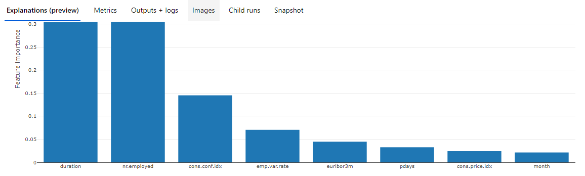
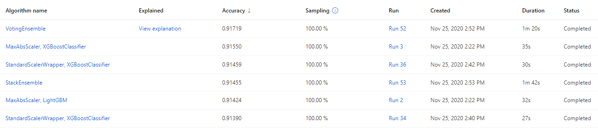

# Optimizing an ML Pipeline in Azure

## Overview
This project is part of the Udacity Azure ML Nanodegree.
In this project, we build and optimize an Azure ML pipeline using the Python SDK and a provided Scikit-learn model.
This model is then compared to an Azure AutoML run.

In the Azure Machine Learning Python SDK, within the machine learning workspace and relevant compute cluster, we can easily load data, pre-process data, tune hyperparameters, train models, choose the best model and finally register the model. Especially with HyperDrive, the hyperparmeter optimization can be automated and with AutoML, all the ML lifecycle can be automated.

* [HyperDrive](https://docs.microsoft.com/en-us/azure/machine-learning/how-to-tune-hyperparameters)

We can automate hyperparameter tuning by using Azure Machine Learning HyperDrive. To enable HyperDrive with AzureML SDK, we have to:
1) Define the parameter search space
2) Specify a primary metric to optimize
3) Specify early termination policy for low-performing runs
4) Allocate resources
5) Launch an experiment with the defined configuration
6) Visualize the training runs
6) Select the best configuration for your model

* [AutoML](https://docs.microsoft.com/en-us/azure/machine-learning/concept-automated-ml)

Without domain knowledge or resources, we can build machine learning models by using AutoML. By just loading the training data, AutoML will automatically build models and do all the relevant required jobs then we can easily check top algorithms, hyperparameters, feature importance and many other useful information.

## Summary
This [dataset](https://archive.ics.uci.edu/ml/datasets/Bank+Marketing) is related with direct phone call marketing campaigns of a Portuguese banking institution to predict whether people subscribe the bank term deposit or not.

Here, we will test two appraoches by using Microsoft Azure Machine Learning platform. 
1) Use [HyperDrive](https://docs.microsoft.com/en-us/azure/machine-learning/how-to-tune-hyperparameters) which automates the hyperparameter tuning for Logistic Regression model 
2) Use [AutoML](https://docs.microsoft.com/en-us/azure/machine-learning/how-to-configure-auto-train)

## Scikit-learn Pipeline
Create the Scikit-learn Logistic Regression model and apply the HyperDrive hyperparameter tuning to auto-tune 'C' which is the inverse of regularization strength. More smaller, stronger regularization.

[Random sampling](https://docs.microsoft.com/en-us/azure/machine-learning/how-to-tune-hyperparameters#random-sampling) supports discrete and continuous hyperparameters. It supports early termination of low-performance runs. 

[Bandit policy](https://docs.microsoft.com/en-us/azure/machine-learning/how-to-tune-hyperparameters#bandit-policy) is based on slack factor/slack amount and evaluation interval. Bandit terminates runs where the primary metric is not within the specified slack factor/slack amount compared to the best performing run.

## AutoML
The best AutoML pipeline is VotingEnsemble and hyperparameters are automatically controlled by AutoML since AutoML does data preprocessing, model selection and hyperparameter optimization, which is the end to end automated machine learning lifecycle solution.

* [VotingEnsemble](https://docs.microsoft.com/en-us/azure/machine-learning/concept-automated-ml#ensemble)

Automated machine learning supports ensemble models, which are enabled by default. Ensemble learning improves machine learning results and predictive performance by combining multiple models as opposed to using single models. 

VotingEnsemble predicts based on the weighted average of predicted class probabilities for classification tasks or predicted regression targets for regression tasks.

AutoML selected the best features as you can see the below diagram.

Top 3 important features are like below.

- duration, which is the last contact duration in seconds: 0.427
- nr.employed, which is the number of employees : 0.334
- cons.conf.idx, which is the consumer confidence index : 0.145

## Pipeline comparison
The accuracy of Scikit-learn logistic regression model with HyperDrive is about 0.90966 and the accuracy of AutoML is about 0.91719 so the difference is not big in terms of accuracy.

From the AutoML experiments, we can also compare different algorithms ran by AutoML like below.

As you can see here, VotingEnsemble algorithm showed the best result in terms of accuracy compared to other algorithms.

## Future work
We can consider auto hyperparameter tuning for other hyperparameters such as max_iter, the maximum number of iterations taken for the solvers to converge or other hyperparameters metioned from the [scikit-learn logistic regression documentation](https://scikit-learn.org/stable/modules/generated/sklearn.linear_model.LogisticRegression.html).

Or we can refer to the result of AutoML and try different algorithms with HyperDrive.

Finally we can try above experiments based on different metrics such as AUC instead of Accuracy since this is the classification problem.
